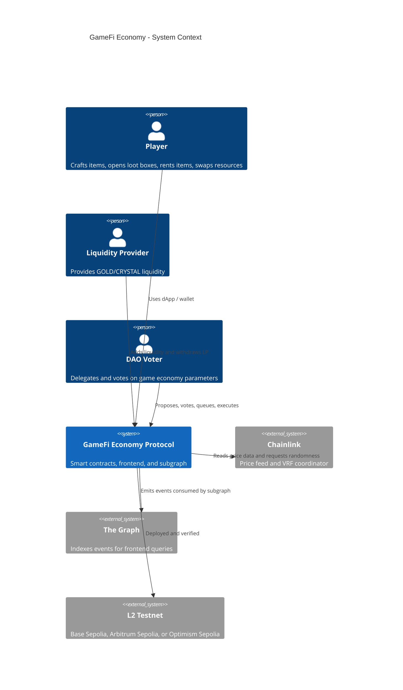
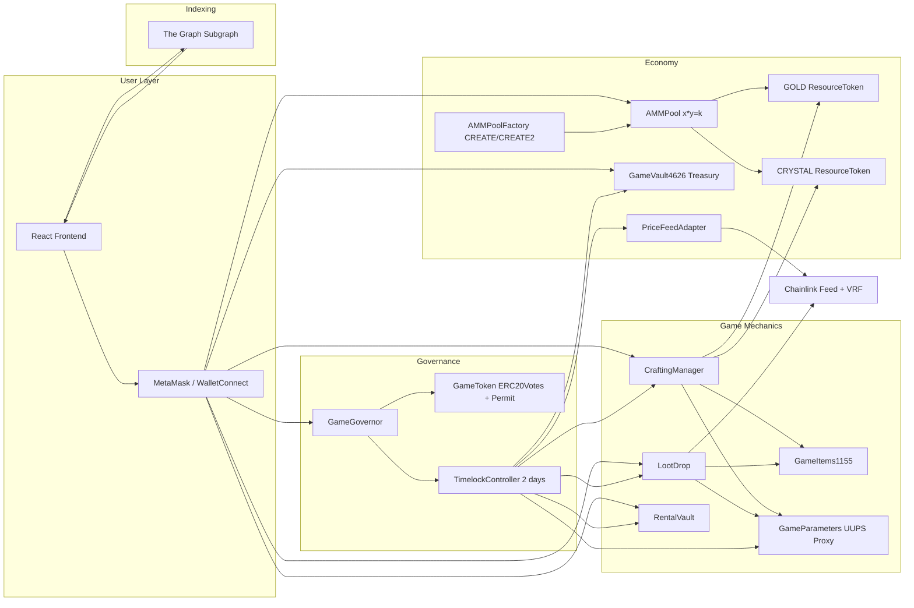
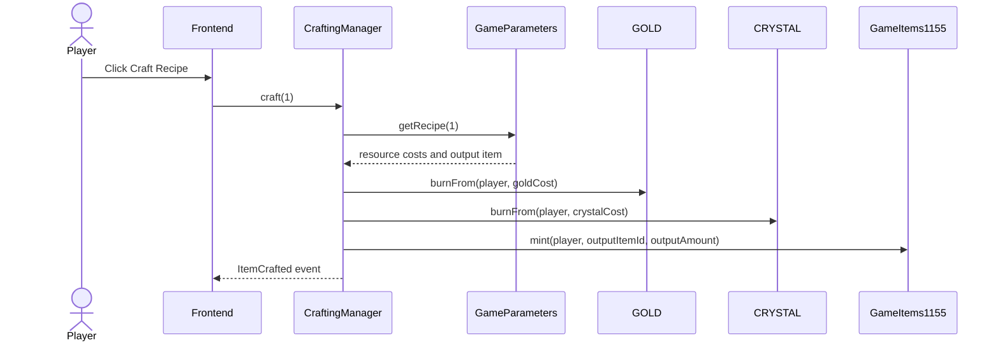
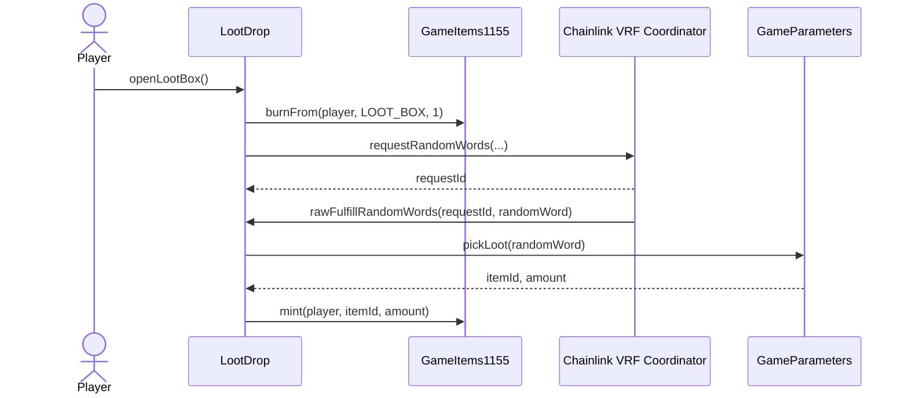
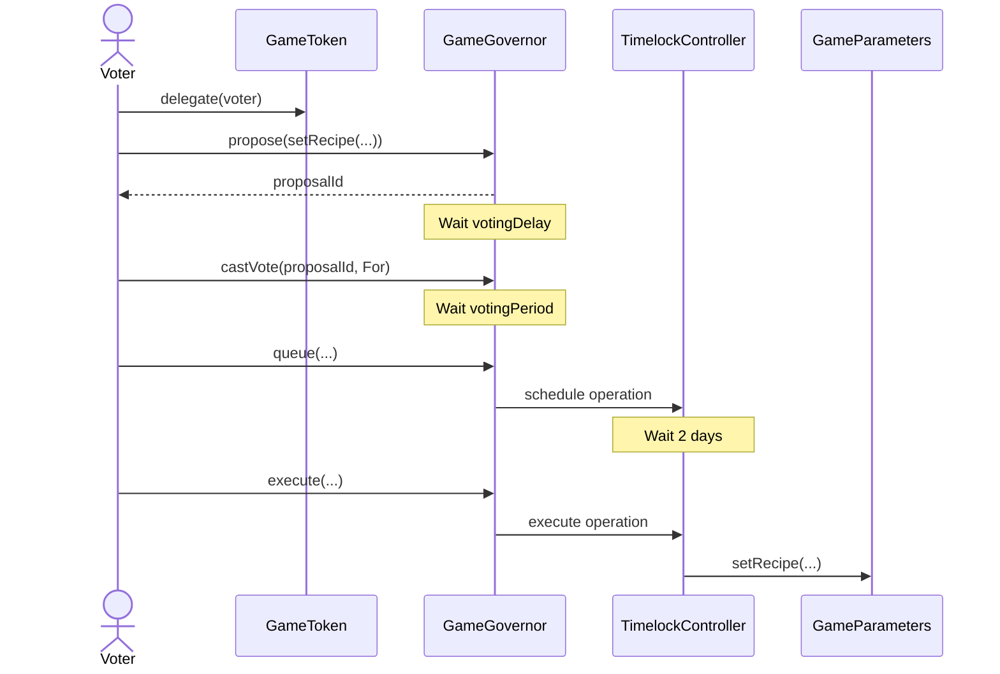
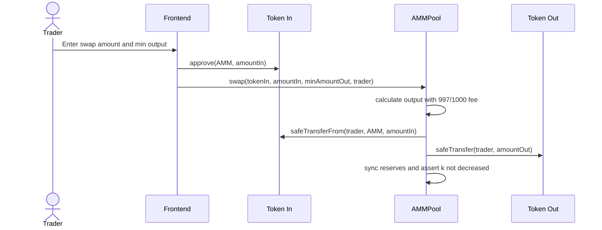

# Architecture and Design Document

## 1. Executive overview

GameFi Economy is a full-stack decentralized protocol for a blockchain game economy. The design combines game mechanics and protocol primitives: ERC-1155 game items, ERC-20 fungible resources, a constant-product AMM, an ERC-4626 treasury vault, an NFT rental vault, Chainlink-compatible VRF loot drops, a Chainlink price feed adapter, OpenZeppelin Governor and Timelock governance, a subgraph, and a React frontend.

The project is intentionally modular. Game-specific contracts are separated from economy contracts. The DAO controls parameters rather than manually changing logic every time a recipe cost or loot table changes. The upgradeable parameter module is narrow on purpose: it stores values that may need future format changes while keeping tokens, AMM, and vault contracts non-upgradeable.

## 2. System context diagram - C4 level 1

## 3. Container and component diagram

## 4. Contract relationship summary

`GameToken` is the governance token. It uses `ERC20Votes` and `ERC20Permit`, so voting power is checkpointed and users can sign approvals with EIP-2612 permits. The initial supply is 100,000,000 GGT. The proposal threshold is 1,000,000 GGT, exactly 1% of the initial supply.

`ResourceToken` is used for fungible game resources. The repository deploys GOLD and CRYSTAL. These are normal ERC-20 tokens with AccessControl, mint, burn, and pause capabilities. The AMM swaps them; the crafting system burns them.

`GameItems1155` is the item economy. It supports loot boxes, crafted items, and rare rewards. The mint and burn roles are not open to users. `CraftingManager` and `LootDrop` receive the minimum roles they need.

`GameParametersV1` is the UUPS-upgradeable contract. It stores recipes and loot drop tables. Governance can update recipes and the loot table through the Timelock. `GameParametersV2` demonstrates a safe V1 to V2 upgrade by adding functions without changing the V1 storage layout.

`CraftingManager` reads a recipe, burns GOLD and CRYSTAL from the player, and mints the configured ERC-1155 output item. It uses ReentrancyGuard and role-based pause/configuration controls.

`LootDrop` burns a loot box and calls a Chainlink VRF-compatible coordinator. The callback mints the reward chosen from the DAO-governed loot table. Randomness is never derived from block timestamp, block hash, or any miner-controllable value.

`RentalVault` escrows ERC-1155 items. A renter pays ETH for usage rights during a fixed period. The item stays in the vault. Lenders claim earnings through pull payments, which avoids forcing ETH transfers during rent execution.

`AMMPool` is a from-scratch constant-product AMM. It applies a 0.3% fee through the 997/1000 formula and mints ERC-20 LP shares. Swap calls require a user-provided minimum output to enforce slippage protection.

`AMMPoolFactory` demonstrates both CREATE and CREATE2. `createPool` deploys normally. `createPoolDeterministic` uses a salt and provides a `predictPoolAddress` helper.

`GameVault4626` is the treasury vault. It accepts the selected ERC-20 asset, mints shares, supports ERC-4626 preview and rounding behavior, and exposes a Timelock-controlled treasury release function.

`PriceFeedAdapter` wraps a Chainlink price feed and rejects invalid, incomplete, or stale answers. Staleness is configurable by governance.

`GameGovernor` uses the OpenZeppelin Governor stack: Governor, GovernorSettings, GovernorCountingSimple, GovernorVotes, GovernorVotesQuorumFraction, and GovernorTimelockControl. The voting delay is 7,200 blocks, the voting period is 50,400 blocks, quorum is 4%, the proposal threshold is 1%, and Timelock delay is 2 days.

## 5. Critical sequence diagrams

### 5.1 Craft item flow

### 5.2 Loot drop flow

### 5.3 DAO propose, vote, queue, execute flow

### 5.4 AMM swap flow

## 6. Storage layout

### GameToken

- ERC20 balances, allowances, total supply, name, symbol.
- ERC20Permit domain separator and nonces.
- ERC20Votes delegation checkpoints.
- AccessControl role membership.
- No upgradeable storage concerns because this contract is not proxied.

### ResourceToken

- ERC20 balances, allowances, total supply.
- ERC20Permit nonces.
- AccessControl roles: DEFAULT_ADMIN_ROLE, MINTER_ROLE, BURNER_ROLE, PAUSER_ROLE.
- Pausable boolean.
- Not upgradeable.

### GameItems1155

- ERC1155 balances by id and account.
- ERC1155 operator approvals.
- ERC1155Supply total supply per id.
- URI string.
- AccessControl roles.
- Pausable boolean.
- Not upgradeable.

### GameParametersV1

- AccessControlUpgradeable role storage.
- UUPS implementation slot is managed by ERC1967.
- PausableUpgradeable storage.
- `_recipes`: mapping from recipe id to recipe struct.
- `_lootItemIds`: loot table item ids.
- `_lootAmounts`: loot table reward amounts.
- `_lootCumulativeBps`: cumulative basis-point weights.
- `__gap[45]`: reserved storage for future versions.

### GameParametersV2

- Adds no new storage.
- Adds `version()` and `recipeHash()` functions.
- Because V2 adds no storage variables, collision with V1 storage is impossible. The V1 gap remains available for future V3 changes.

### CraftingManager

- Immutable `items` address.
- Mutable `parameters` address.
- AccessControl roles.
- Pausable and ReentrancyGuard state.

### LootDrop

- Immutable `items` address.
- Mutable `parameters` and `coordinator`.
- VRF key hash, subscription id, confirmations, callback gas limit.
- Loot box item id.
- `requestToPlayer` mapping.
- AccessControl, Pausable, ReentrancyGuard.

### RentalVault

- Immutable ERC-1155 item token.
- `nextListingId` counter.
- `feeBps`, `feeRecipient`.
- `listings` mapping from id to listing struct.
- `pendingWithdrawals` pull-payment accounting.
- AccessControl, Pausable, ReentrancyGuard.

### AMMPool

- ERC20 LP storage.
- Immutable token0 and token1.
- `reserve0`, `reserve1` as uint112.
- AccessControl and Pausable.
- ReentrancyGuard.

### AMMPoolFactory

- AccessControl roles.
- `getPool[tokenA][tokenB]` mapping.
- `allPools` array.

### GameVault4626

- ERC20 share balances, allowances, total supply.
- ERC4626 asset address.
- AccessControl roles.
- Pausable and ReentrancyGuard.

### PriceFeedAdapter

- Immutable feed address.
- `maxStaleness`.
- AccessControl roles.

## 7. Access-control model

| Role                          | Holder after deployment                 | Power                                            |
| ----------------------------- | --------------------------------------- | ------------------------------------------------ |
| Timelock admin                | Timelock only after deployer revocation | Schedules and executes governance operations     |
| Governor proposer             | Governor                                | Schedules successful proposals in Timelock       |
| Timelock executor             | Address zero                            | Anyone can execute queued operations after delay |
| Token minter                  | Timelock                                | Future emissions only by DAO                     |
| Resource minter/burner/pauser | Timelock and authorized modules         | Resource issuance and emergency pause            |
| Item minter/burner            | CraftingManager, LootDrop, Timelock     | Game item mint/burn flows                        |
| Parameter admin/upgrader      | Timelock                                | Recipe, loot table, and UUPS upgrades            |
| Treasury role                 | Timelock                                | Release treasury vault assets                    |
| Rental fee setter             | Timelock                                | Update rental vault protocol fee                 |

The deployment script grants required module roles first, then grants Timelock authority, then revokes deployer admin roles. This avoids a permanent deployer backdoor.

## 8. Trust assumptions

The DAO is the ultimate governance authority. If DAO voters approve a malicious proposal, the Timelock will execute it after the delay. The 2-day delay gives users and team members time to inspect queued operations and exit if needed.

The deployer is trusted only during deployment. The deployment script is designed to revoke deployer admin powers after the Timelock and Governor are configured. The post-deployment verification script checks key governance properties.

Chainlink feed correctness is assumed within the adapter's staleness window. The adapter defends against stale, zero, and negative answers, but it cannot defend against an incorrect answer accepted by the underlying Chainlink network.

Chainlink VRF is assumed to provide unbiased randomness. The protocol does not use block timestamp or block hash as randomness.

The Graph is not a consensus source. It improves frontend performance and history queries, but contract reads are still the source of truth for balances and state-changing operations.

## 9. Design patterns used

1. Factory pattern: `AMMPoolFactory` deploys pools and records canonical pair addresses.
2. Proxy / UUPS: `GameParametersV1` is deployed behind ERC1967Proxy and upgraded to `GameParametersV2`.
3. Checks-Effects-Interactions: `RentalVault.withdrawListing` updates listing state before transferring the item; `claimEarnings` zeroes pending balance before ETH call.
4. Pull-over-push payments: rental earnings are stored in `pendingWithdrawals` and claimed by recipients.
5. Access Control: all privileged functions use AccessControl roles.
6. Pausable / Circuit Breaker: game, token, AMM, vault, and rental flows include pausing where useful.
7. Oracle adapter: `PriceFeedAdapter` abstracts Chainlink feed behavior and staleness checks.
8. Timelock: all major parameter and treasury actions flow through Timelock.
9. Reentrancy Guard: external functions with token or ETH movements use ReentrancyGuard.
10. State Machine: `RentalVault` moves listings through None, Listed, Rented, Closed states.

## 10. Architecture decision records

### ADR-001: Use ERC-1155 for items

Context: The game needs loot boxes, weapons, armor, and other item classes. ERC-721 is better for unique one-of-one items, but most game assets are semi-fungible.

Options: ERC-721, ERC-1155, custom accounting.

Decision: Use ERC-1155 with ERC1155Supply.

Consequences: Batch minting and balance queries are efficient. The rental vault can escrow semi-fungible items. Unique item metadata would require additional id conventions if needed later.

### ADR-002: Use ERC-20 resource tokens for the AMM

Context: The AMM requirement is for fungible resources. ERC-1155 resources could be wrapped, but that adds complexity.

Options: ERC-20 resources, ERC-1155 resources, wrapper adapter.

Decision: Use ERC-20 GOLD and CRYSTAL for AMM and crafting costs.

Consequences: The AMM is simpler, SafeERC20 can be used, and resources can be burned during crafting. ERC-1155 remains focused on items.

### ADR-003: Store recipes and loot tables in an upgradeable parameter module

Context: Game economies change often. Upgrading all game contracts would be risky.

Options: Hardcode parameters, store in each contract, centralized admin, UUPS parameter contract.

Decision: Use a narrow UUPS parameter contract controlled by Timelock.

Consequences: Governance can update parameters and demonstrate V1 to V2 upgrade. Storage layout is isolated and documented.

### ADR-004: Use a from-scratch AMM instead of importing Uniswap

Context: The project requires the DeFi primitive to be built from scratch.

Options: Fork Uniswap V2, import a library, implement a minimal AMM.

Decision: Implement a minimal x\*y=k AMM with a 0.3% fee and LP shares.

Consequences: The code is auditable and directly tied to tests. It does not include every production AMM feature, such as fee-on-transfer token support.

### ADR-005: Use pull payments for rental income

Context: Pushing ETH to lenders during rental execution can fail or enable reentrancy.

Options: Push immediately, pull payments, ERC-20-only rent.

Decision: Store pending balances and let lenders claim.

Consequences: Rent transactions are safer and simpler. Lenders need a second transaction to collect earnings.

### ADR-006: Use open Timelock executor

Context: After the delay passes, execution should not depend on a single keeper.

Options: Governor-only executor, allowlisted executors, open executor.

Decision: Set EXECUTOR_ROLE to address zero.

Consequences: Anyone can execute queued proposals after the delay, reducing liveness risk. Proposal content is still governed by vote and queue rules.

## 11. Frontend architecture

The frontend uses React, Wagmi, Viem, MetaMask, and WalletConnect. It detects wrong network and prompts the user to switch to the configured L2. It reads token balance, voting power, delegate address, AMM reserves, and vault shares. It provides state-changing actions for swap, craft, vault deposit, delegation, and voting. It also queries proposals from The Graph.

Error handling converts wallet rejections, insufficient balance errors, and reverts into readable messages. This prevents raw RPC errors from appearing in the UI.

## 12. Subgraph data model

The subgraph indexes players, item balances, craft events, pools, swaps, liquidity events, rentals, proposals, and votes. It is intentionally event-driven. Contract state remains canonical, while the subgraph supports historical data and frontend proposal lists.

## 13. Deployment architecture

The deployment script is parameterized by environment variables. It can deploy mock Chainlink feed and VRF contracts for local or test deployments. On a real L2 testnet, the team can provide Chainlink addresses through `.env`. The script prints all addresses, which should be copied to `deployments/<network>.json`, the frontend environment file, and `subgraph.yaml`.

The post-deployment verification script validates key invariants: Timelock delay, Governor delay and period, proposal threshold, Timelock treasury role, Governor proposer role, and open executor role.
